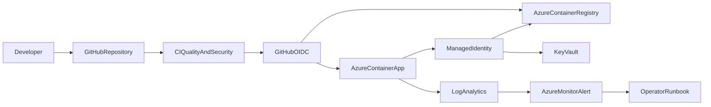

# Azure DevOps Platform

I built this project to demonstrate an end-to-end cloud and DevOps workflow: provisioning Azure infrastructure, delivering a containerized application, and preparing the service for production operations.

> I designed this as a deployable learning project. Azure resources may incur charges, so review [cost controls](docs/COSTS.md) and always run `terraform destroy` after a lab.

## Author

[Elbu27](https://github.com/Elbu27)

## What this demonstrates

- Azure infrastructure as code with Terraform
- Linux containers, health probes, non-root execution, and local Compose
- GitHub Actions CI/CD with Azure OIDC instead of long-lived credentials
- Managed identities and least-privilege Azure RBAC
- Azure Monitor, Log Analytics, KQL, alerting, SLOs, runbooks, and postmortems
- Automated tests, linting, secret scanning, image scanning, and documentation

## Projects

| Project | Evidence | Key technologies |
|---|---|---|
| [1. Azure platform](projects/azure-platform) | Reproducible resources, identity, RBAC, networking, outputs, teardown | Terraform, Azure Container Apps, ACR, Key Vault, VNet, Log Analytics |
| [2. Container API and CI/CD](projects/container-api) | Tested API, hardened image, CI and OIDC deployment | Python, Flask, Docker, GitHub Actions, Trivy |
| [3. Observability and operations](projects/observability) | KQL, alert-as-code, workbook, SLO, runbook, postmortem | Azure Monitor, KQL, Terraform, incident response |

## Architecture



See [the detailed architecture](docs/ARCHITECTURE.md) and [security decisions](docs/SECURITY.md).

## Local quick start

Requirements: Python 3.12+, Docker (optional), Terraform 1.5+ for infrastructure validation.

```bash
make setup
make lint
make test

docker compose -f projects/container-api/compose.yaml up --build
curl http://localhost:8080/healthz
```

Run all available checks with `make check`. Terraform deployment is optional; each project README provides focused instructions.

## Azure deployment order

1. Deploy `projects/azure-platform` with a copied, untracked `terraform.tfvars`.
2. Configure GitHub-to-Azure OIDC using [docs/OIDC-SETUP.md](docs/OIDC-SETUP.md).
3. Run the deployment workflow to build and release the API.
4. Deploy `projects/observability` using the platform workspace output.
5. Exercise an incident with the runbook, then destroy both Terraform stacks.

No real credentials, subscription IDs, email addresses, or secrets belong in Git. Placeholder values are deliberately used throughout.

## Recruiter summary

Through this project, I demonstrate practical junior cloud/DevOps skills: converting requirements into tagged Azure resources, building a secure delivery pipeline, troubleshooting from logs and metrics, and documenting both normal operation and failure recovery. See my [interview talking points](docs/INTERVIEW.md) for concise explanations and résumé bullets.

## Status and limitations

I completed the automated local checks documented in [the verification record](docs/VERIFICATION.md). I have not yet run the live Azure deployment because it requires my subscription configuration, budget approval, OIDC trust, and alert contact details. I documented every deployment step so I can reproduce it safely.
