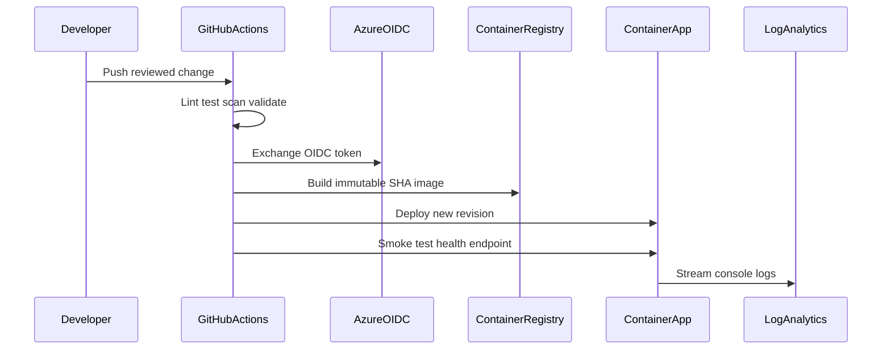

# Architecture

## Delivery flow

## Boundaries

- GitHub CI runs without Azure credentials; CD receives a short-lived token only after environment approval and OIDC claim validation.
- Azure Container Registry has admin access disabled. The application managed identity receives only `AcrPull` on the registry and `Key Vault Secrets User` on the vault.
- The API stores no state. This keeps rollback and scale-out simple for a junior portfolio while leaving room to discuss stateful design.
- Azure Monitor consumes Container Apps console logs. Queries, alert logic, SLOs, and the response process are version-controlled.

## Repository relationship

The projects are independently reviewable but intentionally connected: platform outputs configure delivery; delivery creates revisions and telemetry; observability turns telemetry into action.
