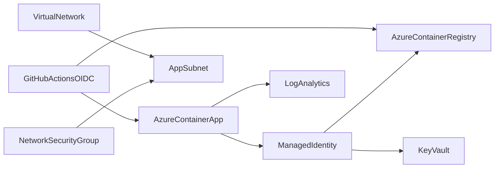

# Project 1: Azure Platform with Terraform

A reusable, low-cost Azure foundation demonstrating infrastructure as code, naming and tagging, network controls, managed identity, RBAC, centralized logs, Key Vault, Container Registry, and Azure Container Apps.

## Architecture



## Prerequisites

- Terraform 1.5+
- Azure CLI authenticated with `az login`
- Permission to create resources and role assignments

## Deploy and destroy

```bash
cd projects/azure-platform
cp terraform.tfvars.example terraform.tfvars
terraform init
terraform plan -out=tfplan
terraform apply tfplan
terraform output

# Prevent ongoing charges when finished
terraform destroy
```

The example uses ACR Basic, scale-to-zero Container Apps, a 0.5 GB/day Log Analytics cap, and 30-day retention. Key Vault purge protection means its soft-deleted name remains reserved after destroy.

## Design decisions

- A user-assigned managed identity pulls images and reads secrets; registry admin credentials stay disabled.
- Key Vault uses Azure RBAC and contains no example secret material.
- The app starts with a Microsoft sample image; CI replaces it with the tested portfolio image.
- The standalone VNet/NSG is an educational network-control example. Connecting a Container Apps environment to a VNet requires a larger delegated subnet and may increase cost.
- Remote Terraform state is intentionally not forced. For team use, migrate state to an encrypted Azure Storage backend with locking and RBAC.
